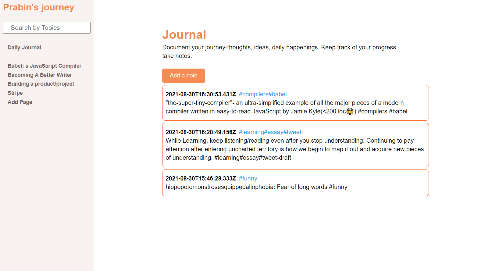

Deployed at : https://myjourney-prabin.herokuapp.com/

  

# myJourney

myJourney is a Journal and a Writing app where Users can
Sign In and record their daily thoughts/ideas and write long
blogs, essays

# Features :rocket:

- Journal/Notes:

  - Document your thoughts, ideas, daily happenings and reflection on your goals.
  - Categorize your Notes by Topics and search them by topics.

- Pages :
  - Collect your thoughts,ideas from Notes and write essays,blogs.

    

## Why I built the project this way
- My plan was to understand how a full web app works while building a delightful experience for users. That's why I built the frontend, backend, connected to DB, and deployed it.
- I tried implementing redux but found it too complex. I was just starting with react and just got overwhelmed so decided to understand React a little better first .

## If I had more time I would change this
- Improve authentication: Currently, the app stores JWT tokens in local Storage for authentication which is not totally secure.
- Make the Add Page/Edit Page form more intuitive, where you can just start typing and the page will be saved automatically. Remove edit Page.
- Add tests: Testing is an essential part of production applications. Cover the essential features of the app with tests.

## Built Using

- Frontend: React
- Backend: Nodejs,Express
- Database: MongoDB
- Hosting: Heroku
